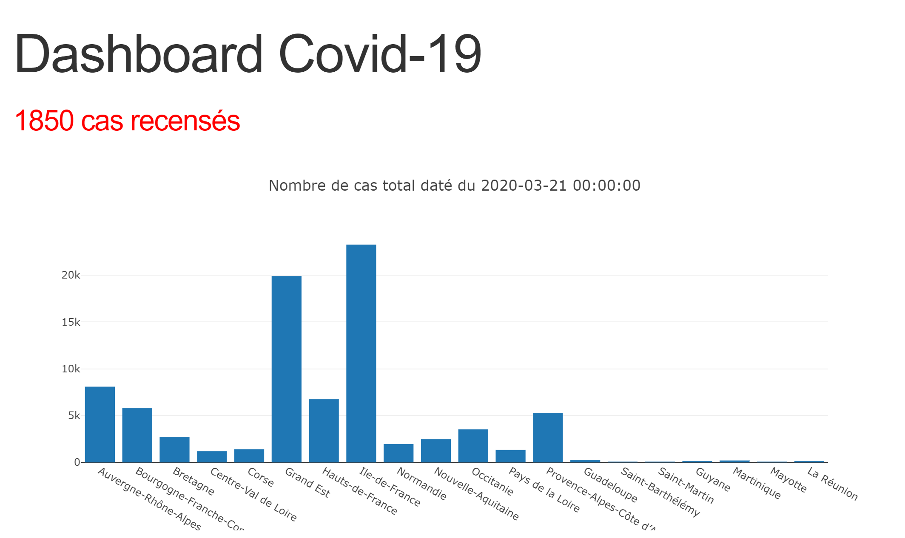
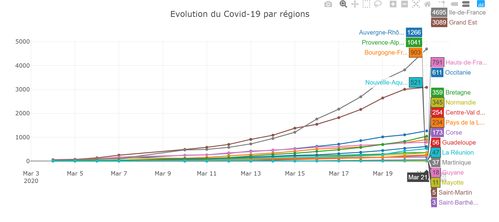
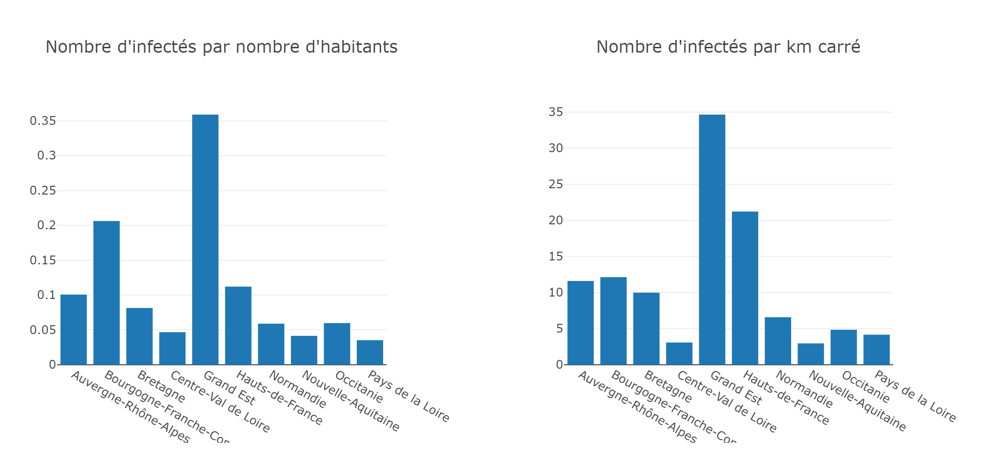

# CoronaDash

CoronaDash is a little project I realised for visualize coronavirus cases in France regions.
I use plotly to realize the dashboard.

## Total cases per regions

## Coronavirus evolution per regions 

## Infected per population in regions and per km2

